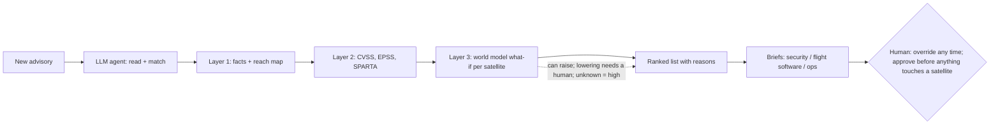

# Periapt — Know Which Flaw Matters First

> **WARNING: this draft was written overnight from a plan the user had not yet reviewed** (`report/plans/2026-09-30-report-draft-plan.md`). Check it against the plan and spec before relying on it. Decisions made during the run: `logs/Overnight_Draft_Log_2026-09-30.md`.
>
> Draft for the author's rewrite. Tags: [RF n] = research/Research_Findings.md item · [Q n] = topic/Topic_Brainstorm_Report.md challenge · [R n] = research/Research_Findings_Review.md item. Strip all tags at the .docx step.

## Opening: 2 a.m.

*An illustrative scene.* It is 2 a.m. A security advisory lands: a flaw in the ground mission-control software could let an attacker send commands to the fleet. The vendor has no patch yet. The CISO of a mid-size satellite operator reads it and thinks of 200 satellites. Some are new. Some have flown for years on tired batteries. Even two launched together sit in different sun, eclipse, radiation and workload, so the same command can do very different damage. The security team, the flight-software team and mission operations each hold part of the answer, and each speaks a different language. One question has to be answered before morning: which satellites are most at risk tonight, and what can safely be done before the vendor's fix arrives? Tomorrow another advisory will arrive, and the same question starts again: **which flaw first, and why?**

## A.0 Overview: Periapt

**Brand.** A *periapt* is a protective amulet; the name also echoes *periapsis*, an orbit's closest point. Together: protection at the closest point of risk.
- **Mission:** "Tell every operator, within minutes of a new flaw, what it means for each satellite, with reasons they can check."
- **Vision:** "The trusted decision layer for every spacecraft operator." We start small and grow as trust is earned.

**Where it sits.** On the Gartner stack, Periapt is a Layer 6 AI application that delivers Layer 7 (AI Security & Risk) outcomes, the layer where the course lists CrowdStrike; it also applies Layer 7 guardrails to its own LLM (A.5). The closest analogue is CrowdStrike's Charlotte AI, which helps analysts triage. Foundation Capital would call it domain-specific AI: the value is knowing satellites, not owning a model. B2B to operators, and B2B2G where those operators serve US defence customers.

**Market.** 14,266 satellites operated at end-2025; 4,434 were deployed in 2025 alone (+65%) [RF 1]. That growth is mostly mega-constellations, so Periapt targets the mid-size tier [R 1]. No official size exists for this niche, so we estimate it ourselves: *sum of the fleet sizes of the named mid-size buyers* (Planet ~200, Iridium ~75, SES ~50, Intelsat ~50, ICEYE ~52–72) ≈ **430–450 satellites across 5 operators** [RF 11]. This is our estimate from a public tracker, not an official figure. For scale only, the whole commercial satellite industry is $303B [RF 1].

**Why now.**
- Advisories outgrow teams: 40,009 CVEs in 2024, 48,185 in 2025, 57,908 year to date to 31 August 2026 [RF 27].
- Tools already match known CVEs to software lists (Thales Alenia Space uses Black Duck [RF 12]); what stays manual is judging what a flaw means for *each satellite* [Q 40].
- At Viasat in 2022, attackers entered through a misconfigured ground VPN appliance, then sent legitimate management commands; Viasat shipped nearly 30,000 modems [RF 4, RF 32].
- ML already forecasts which IT flaws will be exploited (EPSS [RF 32]). Research simulates attacks on satellites (NOS3 [RF 32]), but we found no product that predicts, automatically and per satellite from live data, what a flaw would do.

**Topic fit.** Day zero is the day a flaw becomes known, often before a patch exists. Satellites are not one of the 16 US critical infrastructure sectors [RF 30], but critical sectors depend on them: Viasat's outage cut remote monitoring of ~5,800 wind turbines [RF 4], and the EU lists space as a high-criticality sector [RF 2].

So what does the AI actually do at 2 a.m.?

## A.1 Agentic AI and Value

**The workflow.** Triage: turning each new advisory into a ranked, explained decision for security, flight software and mission ops.

**Three layers; AI only where rules can't reach.**

| Layer | The question it answers | How | What the team gets |
|---|---|---|---|
| 1. Exposure | Which of *our* satellites carry this flaw, and can an attacker reach them through it? | LLM proposes matches; a plain rule confirms each against a cited parts-list line; the reach map traces ground → spacecraft paths | Affected satellites that scanners miss (prose advisories, no parts list), each with the line that proves it, and only the ones an attacker can actually reach |
| 2. Likelihood | How severe is it, and how likely is an attack soon? | CVSS, EPSS (FIRST's free ML exploit forecast [RF 32]), SPARTA: reused, not rebuilt | Scores the team already knows and trusts; nothing new to learn |
| 3. Mission impact | If it were used, what would it do to *each* satellite right now? | Periapt's world model | The same flaw ranked differently per satellite, so the one that would be hurt most gets fixed first |

Rank = likelihood × mission impact, for exposed satellites only. This fills in the operator's own method (Spire ranks by ISO 27005 likelihood × impact [RF 31]) instead of replacing it.

**The two AI parts.** (1) A self-hosted **LLM agent** reads advisories, even prose ones, matches, briefs and orchestrates. (2) A **world model** learned per fleet from telemetry and command history ("state + command → next state"); JEPA-style is the candidate, and JPL's LSTM (Hundman et al. 2018 [RF 32]) is the precedent and the baseline to beat. It is designed to play out "what if these commands were sent?" *Which commands?* The advisory says what the flaw gives an attacker, for example control of the server that sends commands. The reach map says which satellites that server talks to. The possible commands are the ones that server is allowed to send (the operator's own command list), narrowed to the SPARTA attack techniques that fit this kind of access. The world model plays those sequences out on each satellite's current state, and the worst predicted outcome becomes that satellite's impact score. Real attacks often misuse legitimate commands (Viasat [RF 32]), and those command types already appear in the normal operations it learns from. *Illustrative:* "heaters off" should hurt old satellite 12, entering eclipse on a weak battery, more than new satellite 40 in sunlight. It also aims to forecast battery and thermal margin, so a fix window is safe. Outside its data, impact is "unknown" and counts as high.

**Why it is agentic.** One orchestrator works ReAct-style (reason → call a tool → observe), with tools for the parts list, reach map, scores, SPARTA, world model and tickets. It perceives, processes, decides (ranks) and acts (briefs, tickets), then re-ranks on news or overrides. After the team fixes a flaw, it reads the result from the team's own tools, stores it in the record and re-ranks what's left; it never tests or sends the fix. Step limits, validated outputs and the layer-1/2 floor keep it reliable. It runs alone up to the ranking; humans override at any time and approve anything that touches a satellite or ground system.

**Why teams want it** [Q 27, Q 35]: coverage, memory (the record outlives staff turnover), consistency at 2 a.m., and translation (security gets *why*, flight software *what*, ops *when*). A general chatbot can't trace reach or play out commands, and pasting fleet data into one is shadow AI.

| Efficiency | Risk | Innovation |
|---|---|---|
| Analyst hours per advisory; time to decision; coverage | Fewer critical flaws missed; evidence behind approvals. Rare but costly: replacing one lost smallsat costs about $0.5–1M [RF 4]; we don't count on it, it shows what's at stake | Evidence packs for insurers and DoD audits, a method for 800-171's "timely" [RF 30] |

*A rough starting estimate (all inputs are our assumptions, to be measured in the pilot):* hours saved per operator = relevant advisories per week × analyst hours each × share Periapt handles alone. With 20 advisories, 3 hours each and half handled alone, the security team saves 30 hours a week, about 0.75 of one analyst's time, or roughly $85K–120K a year at a general-industry analyst salary of $115K–159K (not space-specific) [RF 5]. It counts security-analyst time only; time saved for flight software and ops is left out.

*Before/after (illustrative):* today, three teams check lists by hand until morning; with Periapt, a ranked list with reasons arrives in minutes. Proof is renewal on these pilot metrics (A.4).

**Tests** [R 17]: world model vs JPL's LSTM on ESA-ADB (fewer false alarms at equal detection) [RF 7, RF 32]; predicted vs actual telemetry after real commands; predicted vs simulator impact on replayed attacks (NOS3-style [RF 32]); agreement with the team in shadow mode; backtest on past advisories, which also tests the hypothesis that IT-trained EPSS holds for space flaws. If it loses to the plain forecaster, only the model changes [Q 33].

*Visual 1 (source):*



If this works, what stops a rival copying it?

## A.2 Architecture, Moat and Defensibility

**Core product architecture.** The A.1 loop (Visual 1) runs on four product features:
1. **Onboarding kit:** forward-deployed engineers build the parts list and reach map with the customer.
2. **The authority rule:** the AI may raise a priority; lowering one needs a human; "unknown" counts as high.
3. **Per-team briefs and tickets**, inside each team's own tools.
4. **The record:** every flaw, ranking, override (with its reason) and outcome, per satellite.

The world model has two parts: a shared base trained only on public data and open simulators, and a thin layer per fleet trained on that customer's data (a known technique [RF 8]). Any model can be swapped in, so Periapt survives if the model changes tomorrow: the model isn't the moat (Foundation Capital).

**The moat: earned trust, and what it builds.** Experts rely less on automation (Sanchez et al., 2011), so trust is earned slowly, in shadow mode, and kept only while the rankings keep being right. In Morningstar's terms it is an intangible asset, like a brand earned one customer at a time. Trust keeps the customer, and staying builds the rest:
- **the record in use:** it feeds each ranking, its overrides train the fleet layer (spacecraft failures are rare, so overrides are the signal [R 11]), and it backs every audit;
- **a workflow switching cost:** tickets, approvals and the audit trail run through Periapt (light platformization);
- **value that grows with time in orbit:** we expect satellites to drift apart as they age, and the fleet layer learns those differences; how fast is a pilot metric.

**Who owns what.** The customer owns its data: telemetry, command history and the record, which it can export. Periapt owns the base model and the software, and licenses the fleet layer only while the subscription runs; on exit it is deleted. A copy would help little anyway: the fleet layer doesn't work without our base, and a frozen model goes stale as satellites age. So a customer who leaves keeps its data but loses a working system. A rival, or the customer's own team, must rebuild the models and integrations and win the experts' trust again [Q 40, Q 43].

**Market structure.** Efficient scale: the niche is small, so few rivals bother [R 19]. The same smallness caps growth, so the longer path runs abroad, starting with allied operators where export rules allow [RF 22].

**Conditional:** a cross-fleet network effect, only through opt-in, minimum-data sharing on the Space Data Association model [RF 31, Q 22], and only if a pooled model beats local ones on held-out pilot data [R 12]. **Not moats:** public data, which proves feasibility for everyone [RF 7], and manufacturer partnerships (no evidence found) [R 13].

**The honest limit:** the moat is thin at the start, and trust is fragile: one missed critical flaw can cost it. That is why the guardrails matter. Who else wants this job?

## A.3 Porter's Five Forces

**The strategic point:** be the neutral commercial layer that builds on public tools (SPARTA, EPSS) and plugs into the operator's own. Every force below pushes towards integrating, not replacing.

*Visual 2:*

| Force | Rating (high = bad for us) | Evidence | What Periapt does |
|---|---|---|---|
| Buyers | High | The five named buyers (A.0) are few and capable, all with formal security programs; SES alone has "over 40" security staff. Globalstar is out (Amazon deal) [RF 11, RF 31] | A copilot that fills in their method, with evidence they can audit |
| Suppliers | Medium | Manufacturer data is concentrating as primes buy up makers [RF 12]; telemetry is the customer's own; public feeds and open-weight LLMs are freely available | Build parts lists with the customer at onboarding instead of relying on manufacturers; self-host an open-weight model |
| Rivalry | Low for satellite-specific impact ranking; crowded for IT | Tenable, Qualys and Nucleus already rank IT flaws [RF 10; TB §10.1] | Use their output; don't sell IT ranking |
| Substitutes | High | The good-enough stack: in-house team + ISO 27005 + scanners with EPSS + SPARTA [RF 31] | Plug into it and prove hours saved |
| New entrants | High | Google (already working with Aerospace), the primes, Booz Allen, Deloitte [RF 32] | Move first with a commercial, unclassified, US-person team; a cleared partner later [R 22] |

Spire is co-opetition, not a buyer: operator, manufacturer and tooling vendor at once [R 15, RF 31].

**Named neighbours.** Aerospace Corp's SPARTA/SPARTEND (framework; on-orbit detection); Aerospace + Google (agentic anomaly monitoring for proliferated-LEO constellations [RF 32]); CT Cubed's IRON GALAXY (assessments, training, cyber ranges [RF 32]); Deloitte Silent Shield (detection); Spire CMP (rollout) [RF 10]. None publicly ranks flaws by predicted impact per satellite, and Periapt leaves fleet monitoring to Aerospace + Google. That is the streetlight effect, though: we searched public claims, and absence isn't proof [R 23].

**Aerospace Corp is a partner, not a rival.** Under FAR 35.017, an FFRDC like Aerospace is not meant to use its privileged access to compete with the private sector [RF 32]. Periapt builds on SPARTA; Aerospace's ASC-100 testbed for ISAC members is a validation route [RF 31].

**Regulation cuts both ways.** No binding US mandate requires flaw prioritisation [RF 30], so compliance won't sell it. But NIST SP 800-171 3.14.1 tells DoD contractors to "Identify, report, and correct system flaws in a timely manner" without defining "timely" [RF 30]. DoD-contracting operators need a method they can show: our beachhead.

**Net:** a hard industry for a generic tool, but workable for a neutral layer with a shared core, configured (not custom-built) to each operator's method and tools.

Inside those operators, who actually buys?

## A.4 Persona and Customer Journey

*Visual 3, part 1: persona card*

> **"The Stretched Sentinel"**, the CISO from our 2 a.m. scene: CISO / VP Security at a mid-size operator that also serves US defence customers [R 26]. Grounded in Planet's live VP & CISO posting, where one role spans cyber, compliance and AI governance [RF 16].
> - *"I don't need another dashboard. I need to know which flaw to fix first, and be able to prove why."* (illustrative)
> - **Pains:** advisory overload; audit pressure; blame for the one flaw that was missed.
> - **Goals:** defend the fleet; show auditors a method.
> - **Decision criteria:** evidence behind every ranking; auditability; never touches the command path; fits the tools the team already has.
> - **Psychographic:** an expert, and so sceptical of automation (A.2).

**Buying committee** [R 27]: the CISO holds the budget; a SecOps analyst is the daily user and champion; the flight-software lead reads the *what* brief and can block adoption if it's wrong; the mission-ops lead approves anything that touches a satellite.

**Diffusion of Innovation.** The category is at the introduction stage of its life cycle (Session 7), so we sell to early adopters: operators with formal programs, US defence customers and fleets with some time in orbit, older or mixed, where the world model has most to say.

**Journey.** Lemon & Verhoef's stages, with Puntoni et al.'s AI experiences, built to escape the pilot trap (Gartner: over 80% of enterprise AI initiatives stall at pilot).

*Visual 3, part 2: journey strip*

| Stage | What happens | AI experience |
|---|---|---|
| Prepurchase | Advisory overload plus a trigger: an audit or an incident | |
| Purchase | Paid pilot and onboarding: forward-deployed engineers build the parts list, reach map and history with the customer; we never start with full data, and we assume operators keep telemetry and command archives [R 14] | Data capture |
| Postpurchase: shadow | Periapt's rankings sit next to the team's own while the world model trains | Classification |
| Postpurchase: assist | Low-impact flaws are auto-triaged and ticketed; humans own the top of the list | Delegation |
| Postpurchase: show | Explanations and evidence packs for the board, insurer and DoD auditor | Social |
| Renewal | Renew on hours saved, time to decision and no critical flaw missed; the loop restarts with new advisories and, later, Stage 2 | |

Shadow mode does the trust work. Satisfaction means performance above expectations, and it drives renewal (Kumar et al. 2019, Session 11). The 2 a.m. fear turns into confidence one ranking at a time.

**Timeline** (an assumption, not a sourced sales cycle) [R 28]: paid pilot → about one quarter in shadow mode → assisted triage → renewal at 12 months.

Delegation raises the obvious question: what happens when the AI is wrong?

## A.5 Governance, Guardrails and US Compliance

**Where humans sit (risk tiers).**

| Tier | What | Who |
|---|---|---|
| Runs alone | Ingest, match, score, what-if, rank, brief, ticket, re-rank | The agent |
| Override, any time (on the loop) | Change any ranking, logged with a reason | Any team |
| Approval (in the loop) | Any action touching a satellite or ground system | Mission-ops lead / system owner |
| Never automated | Changes to the command, boot or authentication path | Humans only |

**When the AI must stop or escalate** [R 30]:
1. No cited parts-list line → human.
2. World model outside its data → "impact unknown", ranked high, flagged.
3. Conflicting advisories → escalate.
4. Flaw touches command authentication or boot path → top priority, humans only.
5. Drift (predictions stop matching telemetry) → layer 3 paused; fall back to layers 1–2.

A **kill switch** lets the operator turn off layer 3 or the whole agent, with the same fallback.

**Hallucination and reliability.** Every match cites a parts-list line and passes a plain-rule check; outputs are structured and validated [R 31].

**AI security.** Advisories are untrusted input, a route for prompt injection, so their text is data, never instructions. **Least privilege:** the agent reads telemetry and writes tickets, with no route to command systems. A sanctioned, self-hosted tool removes the pull towards shadow AI. **Model poisoning:** training data and overrides are logged and vetted, and every retrained model must pass a release test in simulation (replayed attacks, held-out logs, a fixed set of known critical flaws it must still rank high) before it ranks anything. Because the AI can only raise a priority, a poisoned model can't push a flaw below layers 1–2. Why never auto-act? In 2024 one bad CrowdStrike update hit 8.5M Windows devices: being everywhere cuts both ways.

**Monitoring and safety audits.** Drift checks as satellites age (Zillow's pricing model failed when its market shifted). An audit trail on NIST SP 800-53 AU-2/3/6, reviewed at least weekly [RF 24] (Cruise lost a permit partly over missing records). A model card per fleet, and a periodic safety review re-running A.1's tests. **Bias:** the model may under-rank satellites with thin data; "unknown = high" guards against that, and the review checks it.

**Liability.** Decision support with evidence and a stated residual risk, never "certified safe". Periapt ranks and humans act, so exposure is smaller [Q 25]; Air Canada was held to its chatbot's words, so claims stay careful.

**Data privacy and US rules.**
- **NIST AI RMF** [RF 19]: Govern = who owns overrides and approvals; Map = the rank-vs-act boundary; Measure = A.1's tests plus drift; Manage = stop rules and the kill switch.
- **CCPA:** almost all data is machine telemetry; the only personal data is staff names in the audit trail, handled as a service provider [RF 23].
- **FTC:** low fairness risk; capability claims must not overstate.
- **Sector rules:** EAR 9A515 first, ITAR where it applies; deemed-export rules mean only US persons touch customer technical data [RF 22]; NIST SP 800-171 for DoD work [RF 30].
- **Customer exit:** that fleet's layer and our copy of its data are deleted, which is clean because the shared base holds no customer data; only an opt-in pooled model would face the unlearning limit [R 33].

**Trust** = competence (the tests), integrity (the audit trail), benevolence (no route to commands) (Pavlou & Fygenson, 2006). The aim is calibrated trust, between distrust and over-trust (Lee & See, 2004), earned in stages.

Does the whole story hold up?

## Close: Four Lenses, and 2 a.m. Again

**Four lenses** (Session 1):
- *Feasibility:* layers 1–2 use proven tools, and learned spacecraft models already exist (Hundman et al. 2018). The open question is predicting damage from command sequences never seen; named tests decide it, and if it fails, Periapt still ranks on exposure and scores.
- *Usability:* it fits the team's own tools and ranking method, and each team gets its own brief.
- *Desirability:* operators already run formal security programs but face rising advisory volume and an undefined "timely"; Periapt supports their teams as a copilot and doesn't replace them.
- *Viability:* **the biggest risk**: a small buyer pool, people-heavy onboarding, slow trust-based sales, and compliance and model-upkeep costs. We manage it three ways: an onboarding fee for each new fleet or satellite design covers the engineers' setup work, so new work never starts at a loss, while satellites of a known design are added cheaply and the subscription grows with the fleet (priced per satellite, as CrowdStrike prices per endpoint [RF 28]); the product is configured, not custom-built, so it scales; and growth goes abroad in stages.

**Think big, act small.** Stage 1 ranks, explains, suggests a safe fix window and records the outcome. Stage 2 adds fix planning, outcome tracking and feedback to the teams. Stage 3 adds testing the teams' fixes and rollout with partners (Spire-style tools, manufacturer emulators). Each starts once the last has earned trust [Q 42].

**2 a.m., again** (illustrative). By 2:10 the CISO has a ranked list. Satellite 12 is first (reachable from the ground, and "heaters off" would hurt it most in tonight's eclipse); the rest follow, with reasons. The CISO approves the work-around the flight-software brief suggests and goes back to sleep. Which flaw first, and why? Now there is an answer anyone can check.

## References

1. Satellite Industry Association (2026). *29th State of the Satellite Industry Report*.
2. NIST (2020). *SP 800-171 Rev. 2: Protecting Controlled Unclassified Information in Nonfederal Systems and Organizations*.
3. NIST (2023). *AI 100-1: Artificial Intelligence Risk Management Framework (AI RMF 1.0)*.
4. Hundman, K., Constantinou, V., Laporte, C., Colwell, I., & Soderstrom, T. (2018). Detecting Spacecraft Anomalies Using LSTMs and Nonparametric Dynamic Thresholding. *Proc. ACM SIGKDD (KDD '18)*. arXiv:1802.04431.

Course frameworks (Porter; Lemon & Verhoef 2016; Puntoni et al. 2021; Lee & See 2004; Pavlou & Fygenson 2006; Sanchez et al. 2011) are cited in the text.

## Appendix: Thinking and AI Use

**1. Working evidence: two decision trees from my notes.**

*What is the moat?*
```
Cross-fleet network effect (Q10)
 └ Enough shared failures to learn from? No, they're rare (Q13)
    └ Public data? Proves feasibility for everyone, so not a moat (Q18)
       └ Pooled data? Operators won't help rivals (Q22), so only conditional
          └ The customer's own data? It's theirs and leaves with them (Q40)
             └ What keeps them? Earned trust ✓, then the record, workflow and value follow (Q43)
                └ Who owns the model? Base ours; fleet layer licensed, deleted on exit ✓ (Q43)
```

*Where should the AI sit?*
```
Predict patch effects ✗  new code is outside the model's data (R6)
 └ Judge emulator test runs? Works, but a commodity (Q33)
    └ Predict each flaw's impact per satellite ✓  (Q36)
```

**2. AI tools.** Claude Code (Opus) was my main thinking partner: brainstorming, a logged challenge-and-answer record (Q1–Q40), the report blueprint, and a tagged first draft that I rewrote in my own words. Claude subagents (Sonnet/Opus) ran seven sourced research threads and a red-team review that listed 35 weak claims. Rule: no number is used unless it's in the findings file; a verification pass corrected my Viasat story (a misconfiguration, not an unpatched flaw).
- Transcript 1: <Google Drive link — user adds>
- Transcript 2: <Google Drive link — user adds>

**3. The hardest concept: what should the AI actually predict?** I considered three options.
- *What a patch will do to a satellite:* rejected. A patch is new code, outside anything the model has seen (R6).
- *A judge of emulator test runs:* it works, but emulators already exist, so it is a commodity (Q33).
- *Each flaw's impact on each satellite:* chosen. Attacks misuse commands the model has already seen in normal operations, the answer differs per satellite, and it is exactly "prioritisation", the listed topic (Q36).

The trade-off: the chosen option is the least proven, so it comes with named tests and the rule "unknown = high".

That choice raised a second hard question. If the model learns from each customer's own telemetry, the data is theirs, so what stops them leaving with it, and what is our moat at all? Working it through (the first tree) moved the moat from data to earned trust, and split the model into a shared base we own and a thin fleet layer that is licensed and deleted on exit (Q40, Q43).

**4. Accepted, modified, rejected, independently developed.**

| | What |
|---|---|
| Accepted | The satellite niche inside Day-Zero Vulnerability Prioritisation; mid-size operators as the target; reusing EPSS and SPARTA instead of rebuilding them |
| Modified | Moat: network effect → earned trust as the root, with a base/fleet-layer model split; world model: judging patches → predicting flaw impact; Aerospace Corp: rival → complement; scope: the whole flaw-to-fix pipeline → prioritisation only |
| Rejected | Generic vulnerability management (not novel); AI-written patches sent to satellites; the RL planner; customer telemetry as the moat; a revenue figure without evidence |
| Independently raised by me | Regulation cuts both ways (Q17); public data isn't a moat (Q18); in-house teams (Q20); why help competitors (Q22); unit economics (Q24); undo = unreliable (Q25); scope drift away from AI (Q34); replacement vs assistance (Q35); topic fit (Q36); autonomy (Q37); Aerospace as a complement (Q39); matching is already automated (Q40); market size as a labelled estimate (Q41); what each layer gives the team (Q42); trust as the root of the moat, and who owns the model (Q43); configured, not custom, per customer (Q44); a persona not bound to the US (Q45); model poisoning tested in simulation (Q46); feasibility and desirability wording (Q47); onboarding per new fleet (Q48) |
