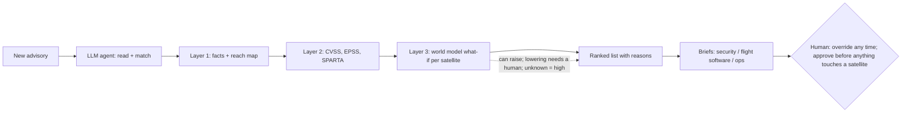

# Periapt — Know Which Flaw Matters First

> **WARNING: this draft was written overnight from a plan the user had not yet reviewed** (`report/plans/2026-09-30-report-draft-plan.md`). Check it against the plan and spec before relying on it. Decisions made during the run: `logs/Overnight_Draft_Log_2026-09-30.md`.
>
> Draft for the author's rewrite. Tags: [RF n] = research/Research_Findings.md item · [Q n] = topic/Topic_Brainstorm_Report.md challenge · [R n] = research/Research_Findings_Review.md item. Strip all tags at the .docx step.

## Opening: 2 a.m.

*An illustrative scene.* It is 2 a.m. A security advisory lands: a flaw in the ground mission-control software could let an attacker send commands to the fleet. The vendor has no patch yet. The CISO of a mid-size satellite operator reads it and thinks of 200 satellites. Some are new. Some have flown for years on tired batteries. The security team, the flight-software team and mission operations each hold part of the answer, and each speaks a different language. One question has to be answered before morning: which satellites are most at risk tonight, and what can safely be done before the vendor's fix arrives? Tomorrow another advisory will arrive, and the same question starts again: **which flaw first, and why?**

## A.0 Overview: Periapt

**Brand.** A *periapt* is a protective amulet; the name also echoes *periapsis*, an orbit's closest point. Together: protection at the closest point of risk.
- **Mission:** "Tell every operator, within minutes of a new flaw, what it means for each satellite, with reasons they can check."
- **Vision:** "The trusted decision layer for every spacecraft operator." We start small and grow as trust is earned.

**Where it sits.** Gartner Layer 7, AI Security & Risk, where the course places CrowdStrike; the closest analogue is CrowdStrike's Charlotte AI, which helps analysts triage. Foundation Capital would call it domain-specific AI: the value is knowing satellites, not owning a model. B2B to operators; B2G through operators with US defence contracts.

**Market.** 14,266 satellites operated at end-2025; 4,434 were deployed in 2025 alone (+65%) [RF 1]. That growth is mostly mega-constellations, so Periapt targets the mid-size tier [R1, RF 11].

**Why now.**
- Advisories outgrow teams: 40,009 CVEs in 2024, 48,185 in 2025, 57,908 year to date to 31 August 2026 [RF 27].
- Tools already match known CVEs to software lists (Thales Alenia Space uses Black Duck [RF 12]); what stays manual is judging what a flaw means for *each satellite* [Q40].
- At Viasat in 2022, attackers entered through a misconfigured ground VPN appliance, then sent legitimate management commands; Viasat shipped nearly 30,000 modems [RF 4, RF 32].
- ML already forecasts which IT flaws will be exploited (EPSS [RF 32]); we found nothing that predicts what a flaw would do to a specific satellite.

**Topic fit.** Day zero is the day a flaw becomes known, often before a patch exists. Satellites are not one of the 16 US critical infrastructure sectors [RF 30], but critical sectors depend on them: Viasat's outage cut remote monitoring of ~5,800 wind turbines [RF 4], and the EU lists space as a high-criticality sector [RF 2].

So what does the AI actually do at 2 a.m.?

## A.1 Agentic AI and Value

**The workflow.** Triage: turning each new advisory into a ranked, explained decision for security, flight software and mission ops.

**Three layers; AI only where rules can't reach.**

| Layer | Question | How |
|---|---|---|
| 1. Facts | Which satellites have it? Can an attacker reach them? | LLM proposes matches; a plain rule confirms each against a cited parts-list line; a reach map checks ground → spacecraft paths |
| 2. Scores | How severe? How likely? | CVSS, EPSS (FIRST's free ML exploit forecast [RF 32]), SPARTA: reused, not rebuilt |
| 3. Impact | What would an attack do to *each* satellite? | Periapt's world model |

Rank = likelihood × impact. This fills in the operator's own method (Spire ranks by ISO 27005 likelihood × impact [RF 31]) instead of replacing it.

**The two AI parts.** (1) A self-hosted **LLM agent** reads advisories, even prose ones, matches, briefs and orchestrates. (2) A **world model** learned per fleet from telemetry and command history ("state + command → next state"); JEPA-style is the candidate, and JPL's LSTM (Hundman et al. 2018 [RF 32]) is the precedent and the baseline to beat. It is designed to play out "what if these commands were sent?" Real attacks often misuse legitimate commands (Viasat [RF 32]), which the model learns from normal operations. *Illustrative:* "heaters off" should hurt old satellite 12, entering eclipse on a weak battery, more than new satellite 40 in sunlight. It also aims to forecast battery and thermal margin, so a fix window is safe. Outside its data, impact is "unknown" and counts as high.

**Why it is agentic.** One orchestrator works ReAct-style (reason → call a tool → observe), with tools for the parts list, reach map, scores, SPARTA, world model and tickets. It perceives, processes, decides (ranks) and acts (briefs, tickets), then re-ranks on news or overrides. Step limits, validated outputs and the layer-1/2 floor keep it reliable. It runs alone up to the ranking; humans override at any time and approve anything that touches a satellite.

**Why teams want it** [Q27, Q35]: coverage, memory (the record outlives staff turnover), consistency at 2 a.m., and translation (security gets *why*, flight software *what*, ops *when*). A general chatbot can't trace reach or play out commands, and pasting fleet data into one is shadow AI.

| Efficiency | Risk | Innovation |
|---|---|---|
| Analyst hours per advisory; time to decision; coverage | Fewer critical flaws missed; evidence behind approvals; a lost smallsat (~$0.5–1M [RF 4]) as tail risk only | Evidence packs for insurers and DoD audits, a method for 800-171's "timely" [RF 30] |

*Before/after (illustrative):* today, three teams check lists by hand until morning; with Periapt, a ranked list with reasons arrives in minutes. Proof is renewal on these pilot metrics (A.4).

**Tests** [R17]: world model vs JPL's LSTM on ESA-ADB (fewer false alarms at equal detection) [RF 7, RF 32]; predicted vs actual telemetry after real commands; predicted vs simulator impact on replayed attacks (NOS3-style [RF 32]); agreement with the team in shadow mode; backtest on past advisories. If it loses to the plain forecaster, only the model changes [Q33].

*Visual 1 (source):*

If this works, what stops a rival copying it?

## A.2 Architecture, Moat and Defensibility

**Core product architecture** (the loop in Visual 1):
1. **Advisory reader:** the LLM agent, which must cite what it matched.
2. **Parts list and reach map**, built with the customer.
3. **Score layer:** CVSS, EPSS and SPARTA, reused.
4. **World-model what-if:** impact per satellite.
5. **Ranking with the authority rule:** the AI can raise a priority; lowering needs a human; "unknown" counts as high.
6. **Per-team briefs and tickets** in each team's own tools.
7. **The record:** every flaw, ranking, override and outcome.

**Would Periapt survive if the model changed tomorrow?** Yes. The model isn't the moat (Foundation Capital); A.1's tests already allow swapping it. The moat is what each customer's use builds up. Using Morningstar's moat sources, ranked:
1. **Intangible asset: the record.** Every flaw, ranking, override (with its reason) and outcome, tied to each satellite's history. Nobody can buy it. Spacecraft failures are rare, so overrides also count as learning signal [R11].
2. **Switching cost: earned trust.** A new vendor must rebuild the parts list and reach map, retrain, and sit through its own shadow mode before sceptical experts trust it. The telemetry archive belongs to the customer and leaves with them [Q40]; the moat is the time and trust to rebuild, not the data.
3. **Switching cost: workflow.** Tickets, approvals and the audit trail run through Periapt, a light form of platformization.
4. **Efficient scale:** the niche is small, so it supports few players [R19].
5. *Conditional:* **a cross-fleet network effect**, only through opt-in, minimum-data sharing on the Space Data Association model [RF 31, Q22], and only if a pooled model beats local ones on held-out pilot data [R12].

**Value grows with time in orbit.** Identical satellites face different orbits, eclipses, radiation and workloads. We assume the differences grow as batteries wear and software versions split. The model needs history per satellite first, so value grows the longer the fleet flies; how fast is a pilot metric, not a promise. A later rival must retrain on that history and re-earn trust.

**Not counted as moats:** public data, which proves feasibility for everyone [RF 7], and manufacturer partnerships (no evidence found) [R13].

The honest limit: the moat is thin at cold start, so the product must deliver full value to a single operator. Who else wants this job?

## A.3 Porter's Five Forces

**The strategic point:** be the neutral commercial layer that builds on public tools (SPARTA, EPSS) and plugs into the operator's own. Every force below pushes towards integrating, not replacing.

*Visual 2:*

| Force | Rating | Evidence | What Periapt does |
|---|---|---|---|
| Buyers | High | Few, capable, named mid-size operators (Planet, Iridium, SES (+Intelsat), ICEYE), all with formal programs; SES has "over 40" security staff. Globalstar is out (Amazon deal) [RF 11, RF 31] | A copilot that fills in their method, with evidence they can audit |
| Suppliers | High for parts lists and manufacturer data; low for public feeds and open-weight LLMs | Primes are buying up manufacturers [RF 12]; telemetry is the customer's own | Build parts lists at onboarding; self-host an open-weight model |
| Rivalry | Low for satellite-specific impact ranking; crowded for IT | Tenable, Qualys and Nucleus already rank IT flaws [RF 10; TB §10.1] | Take their output as input; don't sell IT ranking |
| Substitutes | High | The good-enough stack: in-house team + ISO 27005 + scanners with EPSS + SPARTA [RF 31] | Plug into it and prove hours saved |
| New entrants | High | Google (already working with Aerospace), the primes, Booz Allen, Deloitte [RF 32] | Move first with a commercial, unclassified, US-person team; a cleared partner later [R22] |

Spire is co-opetition, not a buyer: operator, manufacturer and tooling vendor at once [R15, RF 31].

**Named neighbours.** Aerospace Corp's SPARTA/SPARTEND (reference framework and on-orbit detection); Aerospace + Google (agentic anomaly monitoring for proliferated-LEO constellations [RF 32]); CT Cubed's IRON GALAXY (assessments, training, cyber ranges [RF 32]); Deloitte Silent Shield (detection); Spire CMP (rollout) [RF 10]. None publicly ranks flaws by predicted impact per satellite. That is the streetlight effect, though: we searched public claims, and absence isn't proof [R23].

**Aerospace Corp is a partner, not a rival.** Under FAR 35.017, an FFRDC like Aerospace is not meant to use its privileged access to compete with the private sector [RF 32]. Periapt builds on SPARTA and speaks its IDs, and Aerospace's ASC-100 testbed for ISAC members is a validation route [RF 31].

**Regulation cuts both ways.** No binding US mandate requires flaw prioritisation [RF 30], so compliance won't sell it. But NIST SP 800-171 3.14.1 tells DoD contractors to "Identify, report, and correct system flaws in a timely manner" without defining "timely" [RF 30]. DoD-contracting operators need a method they can show: our beachhead.

Inside those operators, who actually buys?

## A.4 Persona and Customer Journey

## A.5 Governance, Guardrails and US Compliance

## Close: Four Lenses, and 2 a.m. Again

## References

## Appendix: Thinking and AI Use
