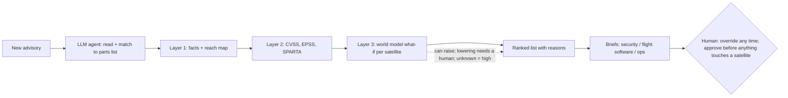

# Periapt Report Draft — Implementation Plan

> **For agentic workers:** REQUIRED SUB-SKILL: Use superpowers:subagent-driven-development (recommended) or superpowers:executing-plans to implement this plan task-by-task. Steps use checkbox (`- [ ]`) syntax for tracking.

**Goal:** Write `report/Periapt_Report_Draft.md`: the full prose draft of the 4-page + 1-page-appendix report, with every factual sentence source-tagged, ready for the user to rewrite in their own voice.

**Architecture:** One markdown file, built section by section in the spec's order. Each task writes one section (or a close pair), then runs shell checks: required terms present, banned wording absent, word count in range. Each task ends with a commit on the branch `docs/report-draft`. A final task runs whole-draft checks, updates HANDOFF, and merges into `main`.

**Tech Stack:** Markdown; `grep`, `awk` and `wc` for the checks; `git`. Mermaid for Visual 1's source (rendered later, at the .docx step).

**Spec:** `report/specs/2026-09-30-report-draft-design.md` (v3, approved 2026-09-30). **Read it fully before Task 1.** The plan argues from it; when they differ, the spec wins.

## Global Constraints

Every task's requirements include these. Values are copied from the spec.

- **Language:** plain, simple words; short sentences; no jargon without a few-word explanation (user rule). The user will rewrite the draft in their own voice, so write clearly, not flashily.
- **Source tags:** every factual sentence carries a tag: `[RF n]` (Research_Findings item), `[Q n]` (topic-report challenge), `[R n]` (review item). Course concepts are cited in-text by author or framework name (Porter; Lemon & Verhoef 2016; Puntoni et al. 2021; Lee & See 2004; Pavlou & Fygenson 2006; Sanchez et al.; Morningstar moat sources; Foundation Capital; Gartner). Reasoning and assumptions are marked in words ("we assume", "illustrative", "a hypothesis we test in the pilot").
- **Check before stating a number:** every number must appear in `research/Research_Findings.md` (CLAUDE.md rule). If it isn't there, leave it out.
- **Use exactly:**
  - 14,266 operational satellites (end-2025); 4,434 deployed in 2025 (+65%) [RF 1];
  - CVEs 40,009 (2024) → 48,185 (2025, +20.6%) → 57,908 **year to date to 31 Aug 2026** [RF 27];
  - Viasat: a **misconfigured** ground VPN appliance, **legitimate** management commands, ~30,000 modems shipped, ~5,800 wind turbines lost remote monitoring, "no material impact" [RF 4, RF 32];
  - SES "over 40" security professionals [RF 31];
  - NIST SP 800-171 3.14.1: "Identify, report, and correct system flaws in a timely manner" [RF 30];
  - smallsat ~$0.5–1M (secondary; tail risk only) [RF 4];
  - EPSS = the probability a CVE is exploited in the next 30 days [RF 32].
- **Never write** (the banned-wording check in Task 9 enforces this):
  - ~16–17k satellites; ~58k CVEs/yr; any Starlink %; "3-person team"; "40% since 2000";
  - "fully tested"; "certified safe"; "legally required to patch"; "nobody validates patches";
  - any revenue or ACV figure;
  - "Viasat was an unpatched flaw"; "satellites are US critical infrastructure";
  - "nobody simulates attacks on satellites"; "Terrain Trace"; SBIR; S.3404;
  - "predicts what a patch will do"; "tools can't tell which satellites have a flaw";
  - "FFRDCs are banned from commercial work"; any satellite service-life number; "the telemetry data is our moat".
- **Hypotheses must be labelled as hypotheses:**
  - how soon the model can tell satellites apart (a pilot metric);
  - impact prediction for command sequences never seen;
  - the battery/thermal margin forecast;
  - exploit likelihood learned on IT carrying over to space;
  - operators keep telemetry and command archives;
  - satellites drift apart as they age;
  - parts libraries per bus type being reused across customers.
- **Must be named:** Aerospace Corp SPARTA/SPARTEND, CT Cubed IRON GALAXY (originality rule), and Aerospace + Google (RF 32).
- **Scope is Stage 1 only:** Periapt finds, scores, ranks and explains. It does **not** write, test or send fixes, and it is **not** a monitoring product. The cut scope appears only as the staged vision in the close.
- **Autonomy wording:** it runs on its own up to the ranking; humans can override at any time ("on the loop"); a human approves before anything touches a satellite or a ground system ("in the loop").
- **Ranking rule:** the AI may raise a priority on its own; lowering it needs a human; outside the model's data means impact counts as high.
- **Hedging limit:** at most one honest-weakness line per section. The real weaknesses go in the four-lens close.
- **Section endings:** each section ends with a one-line handoff to the next.
- **Driving question:** "Which flaw first, and why?" It appears in the opening and in the close.
- **Word targets** (full draft, cut later by the user): Opening 90–140 · A.0 220–320 · A.1 420–560 · A.2 280–380 · A.3 300–420 · A.4 350–470 · A.5 380–500 · Close 130–200 · Appendix 380–520.
- **Git:** work on `docs/report-draft`; conventional commits ending with `Co-Authored-By: Claude Opus 5.5 <noreply@anthropic.com>`; `git merge --no-ff` into `main` at the end; never push; **never stage `README.md`** (uncommitted user edit) or `Discussion on the World model.txt` (user's file).

## Review Focus

These are the failure modes most likely to hurt the user in grading or a viva. Each has a check in the task that owns it.

1. **A hypothesis written as a fact** (e.g. "the world model predicts the damage" with no hedge). Expect hedged wording and a named test. Checked in Task 2 (hedging check) and Task 9 (number audit).
2. **Scope drift back into fixing or monitoring** (e.g. "Periapt rolls out the patch" or "monitors the fleet"). Expect "the team fixes; Periapt ranks and explains". Checked in Task 9 (drift grep).
3. **A missing rubric bullet**, especially A.5's six trust-and-safety items and A.4's "decision-making criteria". Expect each by name. Checked in Tasks 5 and 6.
4. **A number not in Research_Findings, or a banned phrase.** Checked in Task 9 (banned-wording grep plus a manual number audit).
5. **Broken storytelling**: the opening scene not resolved, the persona not returning, the driving question missing. Checked in Task 7 and Task 9.

---

### Task 0: Branch and skeleton

**Files:**
- Create: `report/Periapt_Report_Draft.md`
- Create: `scripts/draft_check.sh` (section-scoped checks used by every task)

- [x] **Step 1: Read inputs.** Read in full: `CLAUDE.md`, `HANDOFF.md` (banner), `report/specs/2026-09-30-report-draft-design.md`, `report/Viva_Prep.md` §9. Keep `research/Research_Findings.md` open for number checks.
- [x] **Step 2: Create the branch.**

```bash
cd "/home/nemox/ZorinProjects/College/BAI BusinessArtificialIntelligense/MidTerm_Project"
git switch main && git switch -c docs/report-draft
```

- [x] **Step 3: Write the skeleton** to `report/Periapt_Report_Draft.md`:

```markdown
# Periapt — Know Which Flaw Matters First

> Draft for the author's rewrite. Tags: [RF n] = research/Research_Findings.md item · [Q n] = topic/Topic_Brainstorm_Report.md challenge · [R n] = research/Research_Findings_Review.md item. Strip all tags at the .docx step.

## Opening: 2 a.m.

## A.0 Overview: Periapt

## A.1 Agentic AI and Value

## A.2 Architecture, Moat and Defensibility

## A.3 Porter's Five Forces

## A.4 Persona and Customer Journey

## A.5 Governance, Guardrails and US Compliance

## Close: Four Lenses, and 2 a.m. Again

## References

## Appendix: Thinking and AI Use
```

- [x] **Step 4: Write `scripts/draft_check.sh`:**

```bash
#!/usr/bin/env bash
# Checks for report/Periapt_Report_Draft.md, scoped to one "## " section.
#   draft_check.sh words "<heading>"        -> word count of that section
#   draft_check.sh has "<heading>" term...  -> ok/MISSING per term (case-insensitive); exit 1 if any missing
set -euo pipefail
f="${DRAFT:-report/Periapt_Report_Draft.md}"
sec() { awk -v h="$1" '$0=="## " h {f=1; next} /^## /{f=0} f' "$f"; }
cmd="$1"; h="$2"; shift 2
case "$cmd" in
  words) sec "$h" | wc -w ;;
  has) miss=0
       for t in "$@"; do
         if sec "$h" | grep -qiF -- "$t"; then echo "ok  $t"; else echo "MISSING $t"; miss=1; fi
       done
       exit $miss ;;
  *) echo "usage: $0 words|has <heading> [terms...]" >&2; exit 2 ;;
esac
```

- [x] **Step 5: Verify the skeleton and the script.**

Run: `grep -c '^## ' report/Periapt_Report_Draft.md` → expect `10`.
Run: `bash scripts/draft_check.sh words "A.1 Agentic AI and Value"` → expect `0`.
Run: `bash scripts/draft_check.sh has "A.1 Agentic AI and Value" "zzz"; echo "exit=$?"` → expect `MISSING zzz` and `exit=1`.

- [x] **Step 6: Commit.**

```bash
git add report/Periapt_Report_Draft.md scripts/draft_check.sh
git commit -m "docs(report): add draft skeleton and section check script

Co-Authored-By: Claude Opus 5.5 <noreply@anthropic.com>"
```

**Every later task** uses `bash scripts/draft_check.sh has "<heading>" terms...` (expected: all `ok`, exit 0) and `bash scripts/draft_check.sh words "<heading>"`. The heading is the text after `## `, exactly as written in the skeleton.

---

### Task 1: Opening scene + A.0 Overview

**Spec:** §3 threads, §4 "Opening scene", §4 "A.0".

**Content (all required):**
- **Opening (fiction, marked illustrative):**
  - 2 a.m.; an advisory lands; a flaw in ground mission-control software could let an attacker send commands to the fleet;
  - the CISO of a mid-size operator; 200 satellites; no patch yet;
  - the question: which satellites are most at risk tonight, and what can be done before the vendor's fix?
  - end with the driving question: "Which flaw first, and why?"
- **A.0 brand:** name story (amulet + periapsis, "protection at the closest point of risk"); mission ("Tell every operator, within minutes of a new flaw, what it means for each satellite, with reasons they can check"); vision ("the trusted decision layer for every spacecraft operator").
- **A.0 stack:** Gartner Layer 7 (AI Security & Risk), the layer where the course places CrowdStrike; CrowdStrike's Charlotte AI (triage copilot) as the analogue; strategic/domain-specific AI (Foundation Capital); B2B, with B2G via DoD contractors.
- **A.0 market:** 14,266 / 4,434 (+65%) [RF 1]; growth is mostly mega-constellations; the target is the mid-size tier [R1].
- **A.0 why now:** the CVE series with "year to date" [RF 27]; tools already match listed CVEs (scanners; SBOM tools, e.g. Thales Alenia uses Black Duck [RF 12]), but judging meaning per satellite is manual; attackers can use legitimate commands (Viasat [RF 4, RF 32]); EPSS forecasts exploitation for IT [RF 32], but nothing predicts impact on a specific satellite.
- **A.0 topic fit:** "day zero" = the day a flaw becomes known, often before a patch. Critical infrastructure = infrastructure critical sectors depend on (Viasat → ~5,800 turbines [RF 4]; EU NIS2 lists space [RF 2]). Do **not** call satellites a US critical-infrastructure sector.
- End with the handoff to A.1.

- [x] **Step 1: Write both sections** under their headings, following the content list.
- [x] **Step 2: Required-term check.**

```bash
bash scripts/draft_check.sh has "Opening: 2 a.m." "2 a.m." "200 satellites" "no patch" "Which flaw first" "illustrative"
bash scripts/draft_check.sh has "A.0 Overview: Periapt" "periapsis" "Layer 7" "Charlotte" "14,266" "4,434" "57,908" "year to date" "EPSS" "legitimate" "misconfigured" "day zero" "Black Duck"
```

Expected: all `ok`, exit 0.
- [x] **Step 3: Word counts.** `bash scripts/draft_check.sh words "Opening: 2 a.m."` → 90–140; `bash scripts/draft_check.sh words "A.0 Overview: Periapt"` → 220–320. If a count is outside its range, edit and re-run.
- [x] **Step 4: Commit** with the message `docs(report): draft opening scene and A.0 overview`.

---

### Task 2: A.1 Agentic AI and Value (+ Visual 1 source)

**Spec:** §2.1–§2.3, §4 "A.1".

**Content (all required):**
- **Workflow:** triage, from advisory to a ranked, explained decision, across security, flight software and mission ops.
- **Three layers** (facts → standard scores → impact per satellite), and the claim that the AI works only where rules can't reach. Rank = likelihood × impact, filling in the operator's existing method (Spire ranks by ISO 27005 likelihood × impact [RF 31]).
- **Two AI parts:** (1) the LLM agent (reads, matches with a cited parts-list line, briefs, orchestrates); (2) the world model (per-fleet, from telemetry + command history; "what if these commands were sent"; margin forecast). JEPA-style is the candidate. The precedent is Hundman et al. 2018 [RF 32]. Include the worked example: "heaters off" hurts old satellite 12, going into eclipse on a weak battery, more than new satellite 40 in sunlight (illustrative).
- **Agentic:** an orchestrator working ReAct-style (reason → tool → observe); perceive → process → decide → act; the tool list; reliability patterns (step limits, validated outputs, layer-1/2 floor as a check, retry). Autonomy boundary as in Global Constraints.
- **Why teams want it:** coverage, memory, consistency, translation between teams. Versus a general assistant: it can't trace reach or play out commands; pasting fleet data into public tools is shadow AI.
- **Value in three layers, no revenue figure:**
  1. a value table (efficiency / risk / innovation) as a markdown table;
  2. a before/after of the 2 a.m. scene, with durations marked **illustrative**;
  3. renewal on pilot metrics.
- **Five named tests (R17):** world model vs JPL LSTM on ESA-ADB (fewer false alarms at equal detection) [RF 7, RF 32]; predicted vs actual telemetry after real commands; predicted vs simulator impact on replayed attack scenarios (NOS3-style [RF 32]); ranking agreement in shadow mode; backtest on past advisories. Add the line "if it loses to the forecaster, only the model choice changes" [Q33].
- **Visual 1 source**, as a mermaid block:



- End with the handoff to A.2.

- [x] **Step 1: Write A.1**, including the value table and the mermaid block.
- [x] **Step 2: Required-term check.**

```bash
bash scripts/draft_check.sh has "A.1 Agentic AI and Value" "ReAct" "orchestrat" "world model" "Hundman" "ISO 27005" "EPSS" "SPARTA" "shadow AI" "ESA-ADB" "illustrative" "renewal" "efficiency" "innovation" "mermaid" "unknown" "heaters"
```

Expected: all `ok`, exit 0.
- [x] **Step 3: Hypothesis hedging check.** Every sentence claiming what the world model predicts must carry a hedge.

Run: `awk '$0=="## A.1 Agentic AI and Value"{f=1;next}/^## /{f=0}f' report/Periapt_Report_Draft.md | grep -i "world model" | grep -viE "hypothes|test|pilot|candidate|assum|aim|designed|expect|learn"`

Expected: no output, or only lines that clearly describe the design rather than claim a result. Rephrase any line that states a result as fact.
- [x] **Step 4: Word count.** `bash scripts/draft_check.sh words "A.1 Agentic AI and Value"` → 420–560 (the mermaid block counts a little).
- [x] **Step 5: Commit** with the message `docs(report): draft A.1 agentic AI and value`.

---

### Task 3: A.2 Architecture, Moat and Defensibility

**Spec:** §4 "A.2" (the rubric puts "Core Product Architecture" here).

**Content (all required):**
- **Core product architecture (features):** advisory reader · parts and reach map · score layer · world-model what-if · ranking with the authority rule · per-team briefs and tickets · the record. Refer back to Visual 1.
- **"Would Periapt survive if the model changed tomorrow?"** Yes (Foundation Capital: the model isn't the moat).
- **Moats, ranked, using Morningstar's names:**
  1. intangible asset: the record (flaws, rankings, overrides with reasons, outcomes) [R11];
  2. switching cost: earned trust. A new vendor must rebuild and pass its own shadow mode. *Honest limit:* the telemetry archive belongs to the customer [Q40];
  3. switching cost: workflow and integrations (light platformization);
  4. efficient scale (niche) [R19];
  5. conditional: a cross-fleet network effect via SDA-style opt-in [RF 31, Q22], with the pooled vs local test [R12].
- **Value grows with time in orbit** (§2.5), labelled a hypothesis and pilot metric.
- **Removed from the moat:** public data (feasibility only [RF 7]) and manufacturer partnerships [R13].
- One honest line: thin at cold start. End with the handoff to A.3.

- [x] **Step 1: Write A.2.**
- [x] **Step 2: Required-term check.**

```bash
bash scripts/draft_check.sh has "A.2 Architecture, Moat and Defensibility" "intangible" "switching cost" "efficient scale" "network effect" "changed tomorrow" "record" "shadow mode" "belongs to the customer" "time in orbit"
```

Expected: all `ok`, exit 0.
- [x] **Step 3: Moat-claim check** (a banned claim).

Run: `grep -niE "telemetry (data|archive) is (our|the) moat|data moat" report/Periapt_Report_Draft.md`
Expected: no output.
- [x] **Step 4: Word count.** `bash scripts/draft_check.sh words "A.2 Architecture, Moat and Defensibility"` → 280–380.
- [x] **Step 5: Commit** with the message `docs(report): draft A.2 architecture and moat`.

---

### Task 4: A.3 Porter's Five Forces (+ Visual 2)

**Spec:** §4 "A.3".

**Content (all required):**
- **Strategic point first:** be the neutral commercial layer that builds on public tools (SPARTA, EPSS) and plugs into the operator's own.
- **Visual 2** as a markdown table with columns Force · Rating · Evidence · What Periapt does:
  - Buyers: high. Planet, Iridium, SES(+Intelsat), ICEYE; formal programs; SES 40+; Spire's ISO 27005; Globalstar out [RF 11, RF 31]. Spire is co-opetition, not a buyer [R15]. Say "named mid-size operators".
  - Suppliers: parts lists and manufacturer data high [RF 12]; telemetry is the customer's own; public feeds and open-weight LLMs low.
  - Rivalry: low for satellite-specific impact ranking; crowded for IT (Tenable, Qualys, Nucleus).
  - Substitutes: high (the good-enough stack).
  - New entrants: high (Google, primes, Booz Allen, Deloitte).
- **Named adjacents:** Aerospace SPARTA/SPARTEND; Aerospace + Google (agentic anomaly monitoring for proliferated-LEO constellations) [RF 32]; CT Cubed IRON GALAXY (assessments, training, cyber ranges) [RF 32]; Deloitte Silent Shield (detection); Spire CMP (rollout).
- **Aerospace Corp is a partner:** under FAR 35.017 an FFRDC is not meant to use its privileged access to compete with the private sector [RF 32]; the ASC-100 testbed as a validation route [RF 31].
- **Streetlight-effect caveat:** absence of public claims isn't proof [R23].
- **Entry path:** a commercial, unclassified, US-person team; a cleared partner later [R22].
- **Regulation both ways:** no binding US mandate [RF 30]; 800-171 3.14.1 as the DoD-contractor beachhead.
- End with the handoff to A.4.

- [x] **Step 1: Write A.3** with the table.
- [x] **Step 2: Required-term check.**

```bash
bash scripts/draft_check.sh has "A.3 Porter's Five Forces" "SPARTA" "SPARTEND" "IRON GALAXY" "Google" "FAR 35.017" "streetlight" "Globalstar" "ICEYE" "3.14.1" "substitut" "new entrant" "supplier" "rivalry" "buyer"
```

Expected: all `ok`, exit 0.
- [x] **Step 3: FAR wording check.**

Run: `grep -niE "banned from|prohibited from (all )?commercial|barred from" report/Periapt_Report_Draft.md`
Expected: no output.
- [x] **Step 4: Word count.** `bash scripts/draft_check.sh words "A.3 Porter's Five Forces"` → 300–420.
- [x] **Step 5: Commit** with the message `docs(report): draft A.3 five forces`.

---

### Task 5: A.4 Persona and Customer Journey (+ Visual 3 content)

**Spec:** §4 "A.4", §2.4.

**Content (all required; each rubric bullet by name):**
- **Persona card (Visual 3 content)** as a compact markdown block: "The Stretched Sentinel"; CISO/VP Security at a US mid-size operator with DoD contracts [R26], grounded in Planet's VP & CISO posting [RF 16].
  - **Pains:** advisory overload, audit pressure, blame for the one flaw missed.
  - **Goals:** defend the fleet, show auditors a method.
  - **Decision criteria:** evidence, auditability, never touches the command path, fits the tools the team already has.
  - **Psychographic:** an expert, and so sceptical of automation (Sanchez et al.).
- **Buying committee:** the CISO holds the budget; a SecOps analyst is the daily user and champion; the mission-ops lead approves [R27].
- **Diffusion of Innovation:** early adopters are formal programs, fleets with time in orbit (older or mixed), and DoD contracts. The product lifecycle is at the introduction stage (S7).
- **Journey strip (Visual 3 content):** Lemon & Verhoef stages × Puntoni experiences, built to escape the Gartner pilot trap (80%+ of AI initiatives stall at pilot):
  - prepurchase (trigger);
  - purchase: paid pilot and **data capture** (forward-deployed engineers build the parts list, reach map and history; we never start with full data);
  - postpurchase: **classification** (shadow mode, which also trains the model) → **delegation** (low-impact flaws auto-triaged) → **social** (evidence packs for board, insurer and DoD auditor) → renewal → loop back to new advisories and Stage 2.
- **Timeline, labelled an assumption** [R28]: paid pilot → shadow mode ~1 quarter → assisted triage → renewal at 12 months.
- End with the handoff to A.5.

- [x] **Step 1: Write A.4** with the persona card and the journey strip.
- [x] **Step 2: Required-term check.**

```bash
bash scripts/draft_check.sh has "A.4 Persona and Customer Journey" "Stretched Sentinel" "pain" "goal" "decision criteria" "psychographic" "buying committee" "early adopter" "prepurchase" "postpurchase" "data capture" "classification" "delegation" "social" "renewal" "pilot trap" "assumption" "onboarding"
```

Expected: all `ok`, exit 0.
- [x] **Step 3: Word count.** `bash scripts/draft_check.sh words "A.4 Persona and Customer Journey"` → 350–470.
- [x] **Step 4: Commit** with the message `docs(report): draft A.4 persona and journey`.

---

### Task 6: A.5 Governance, Guardrails and US Compliance

**Spec:** §4 "A.5".

**Content (all required; the rubric's six items by name):**
- **Autonomy table (risk tiers)** as markdown:
  - runs alone: ingest, match, score, what-if, rank, brief, ticket, re-rank;
  - human any time: override, logged with a reason;
  - human approval: any action on a satellite or ground system;
  - never automated: command, boot or authentication-path changes.
- **Human oversight + HITL overrides** (rubric items 1–2).
- **Stop/escalate rules** (item 3), all five:
  1. no cited parts-list line → human;
  2. outside the model's data → "unknown", ranked high, flagged;
  3. conflicting advisories → escalate;
  4. command-auth or boot path → top priority, humans only;
  5. drift → layer 3 paused, fall back to layers 1–2.

  Plus the kill switch.
- **Hallucination and reliability** (item 4): citation-required matching, deterministic confirmation, structured outputs.
- **AI security:** prompt injection via advisories; least privilege (read telemetry, write tickets, no route to command systems); shadow AI; CrowdStrike 2024 (8.5M devices) as the reason it never auto-acts.
- **Monitoring and safety audits** (item 5): drift (Zillow); AU-2/3/6 audit trail with at least weekly review (Cruise) [RF 24]; model cards; a periodic safety review re-running the A.1 tests; bias: data-poor satellites under-ranked → guarded by "unknown = high".
- **Liability:** decision support with evidence and a stated residual risk, never "certified safe"; smaller exposure because Periapt ranks and humans act; Air Canada.
- **Data privacy and regulation** (item 6) + US jurisdiction:
  - NIST AI RMF Govern/Map/Measure/Manage mapping [RF 19];
  - CCPA: service provider; machine data; terminal data only as aggregate counts [RF 23];
  - FTC: one line on not overstating claims;
  - EAR 9A515 first, ITAR where it applies, deemed export → US-person access [RF 22];
  - 800-171 [RF 30].
- **Customer exit:** per-fleet model and data deleted; the pooled-model limit stated [R33].
- **Trust close:** calibrated trust between over- and under-trust (Lee & See); competence, integrity, benevolence (Pavlou & Fygenson). End with the handoff to the close.

- [x] **Step 1: Write A.5** with the autonomy table.
- [x] **Step 2: Required-term check.**

```bash
bash scripts/draft_check.sh has "A.5 Governance, Guardrails and US Compliance" "override" "stop" "escalat" "kill switch" "hallucinat" "prompt injection" "least privilege" "CrowdStrike" "drift" "audit" "model card" "bias" "Air Canada" "NIST AI RMF" "Govern" "Map" "Measure" "Manage" "CCPA" "FTC" "EAR" "ITAR" "800-171" "competence" "integrity" "benevolence" "certified safe"
```

Expected: all `ok`, exit 0. "certified safe" may only appear inside "never 'certified safe'".
- [x] **Step 3: "certified safe" context check.**

Run: `grep -ni "certified safe" report/Periapt_Report_Draft.md`
Expected: every hit is a negation ("never", "not").
- [x] **Step 4: Word count.** `bash scripts/draft_check.sh words "A.5 Governance, Guardrails and US Compliance"` → 380–500.
- [x] **Step 5: Commit** with the message `docs(report): draft A.5 governance`.

---

### Task 7: Close + References

**Spec:** §4 "Close", "References".

**Content (all required):**
- **Four lenses** (Session 1), one line each with its honest risk:
  - *Feasibility:* impact prediction is the one unproven piece, with named tests and a safe fallback.
  - *Usability:* fits existing tools and methods; each team gets its brief.
  - *Desirability:* a copilot, not a replacement; value grows with time in orbit.
  - *Viability:* subscription + onboarding fee; people-heavy on purpose; small buyer pool; compliance (EAR/ITAR, CMMC) counts as part of viability. **This is the weakest point.**
- **Staged vision (dream big):** Stage 2 = fix-window planning + outcome tracking; Stage 3 = validation and rollout with partners. Each stage starts only once trust is earned. Think big, act small.
- **Bookend:** 2 a.m. again. By 2:10 the CISO has a ranked list with reasons, approves the first work-around, and goes back to sleep (illustrative). Answer the driving question.
- **India:** leave it out (on hold).
- **References (exactly these four):**
  1. Satellite Industry Association, *29th State of the Satellite Industry Report* (2026). Cite the report, not the press release.
  2. NIST SP 800-171 Rev. 2 (2020), *Protecting Controlled Unclassified Information in Nonfederal Systems and Organizations*.
  3. NIST AI 100-1 (2023), *Artificial Intelligence Risk Management Framework (AI RMF 1.0)*.
  4. Hundman, K., Constantinou, V., Laporte, C., Colwell, I., & Soderstrom, T. (2018). Detecting Spacecraft Anomalies Using LSTMs and Nonparametric Dynamic Thresholding. *Proc. ACM SIGKDD (KDD '18)*. arXiv:1802.04431.

- [x] **Step 1: Write the close and the references.**
- [x] **Step 2: Required-term check.**

```bash
bash scripts/draft_check.sh has "Close: Four Lenses, and 2 a.m. Again" "Feasibility" "Usability" "Desirability" "Viability" "weakest" "Stage 2" "Stage 3" "2:10" "Which flaw first"
bash scripts/draft_check.sh has "References" "Satellite Industry Association" "800-171" "AI 100-1" "Hundman"
```

Expected: all `ok`, exit 0.
- [x] **Step 3: Reference count.**

Run: `awk '$0=="## References"{f=1;next}/^## /{f=0}f' report/Periapt_Report_Draft.md | grep -cE '^[0-9]+\.'`
Expected: `4`
- [x] **Step 4: Word count.** `bash scripts/draft_check.sh words "Close: Four Lenses, and 2 a.m. Again"` → 130–200.
- [x] **Step 5: Commit** with the message `docs(report): draft close and references`.

---

### Task 8: Appendix (1 page)

**Spec:** §4 "Appendix". Brief §D lists the four required parts.

**Content (all required):**
1. **Working evidence:** two decision trees as indented text or mermaid.
   - *Moat:* federated network effect (Q10) → rare events (Q13) → public data (Q18) → won't share (Q22) → the record + earned trust (Q40).
   - *Where the AI sits:* predict patch effects ✗ (R6) → judge test runs (commodity, Q33) → predict flaw impact per satellite ✓ (Q36).
2. **AI tools:** Claude Code (Opus) as the main thinking partner; Sonnet/Opus subagents for sourced research and a red-team review (35 weaknesses); verification discipline (numbers checked before use; RF item 32). Leave two link lines for the user: `Transcript 1: <Google Drive link — user adds>` and `Transcript 2: <Google Drive link — user adds>`. These are the only allowed placeholders, because only the user can create the links.
3. **Hardest concept:** *what the AI should actually predict.* The options: patch effect (fails: new code), a judge of test runs (works, but commodity), flaw impact per satellite (chosen: in-distribution commands, per-satellite value, fits the topic). Add one line noting the alternative (defensibility), which the user may swap in.
4. **Accepted / modified / rejected / independently developed:** a short 4-row table. Raised independently by the user: regulation cuts both ways (Q17), public data isn't a moat (Q18), in-house teams (Q20), helping competitors (Q22), unit economics (Q24), undo = unreliable (Q25), scope drift from AI (Q34), replacement vs assistance (Q35), topic fit (Q36), autonomy (Q37), the Aerospace complement (Q39), matching is already automated (Q40).

- [x] **Step 1: Write the appendix.**
- [x] **Step 2: Required-term check.**

```bash
bash scripts/draft_check.sh has "Appendix: Thinking and AI Use" "decision tree" "Claude Code" "subagent" "Transcript 1" "Transcript 2" "hardest" "accepted" "modified" "rejected" "independently" "Q34" "Q36"
```

Expected: all `ok`, exit 0.
- [x] **Step 3: Word count.** `bash scripts/draft_check.sh words "Appendix: Thinking and AI Use"` → 380–520.
- [x] **Step 4: Commit** with the message `docs(report): draft appendix`.

---

### Task 9: Whole-draft checks, HANDOFF, merge

**Files:**
- Modify: `report/Periapt_Report_Draft.md` (fixes only)
- Modify: `HANDOFF.md` (banner line)

- [x] **Step 1: Banned-wording check.**

```bash
grep -niE "16,?000|17,?000|16k|58,?000 CVEs|Starlink[^.]*%|3-person|three-person|40% of CubeSats|since 2000|fully tested|legally required|nobody validates|\bACV\b|annual contract value|revenue of|Terrain Trace|SBIR|S\.? ?3404|predicts? what (a|the) patch|banned from|barred from|service life|year design life|critical-infrastructure sector|unpatched (ground|VPN)" report/Periapt_Report_Draft.md
```

Expected: no output. Rewrite any hit.
- [x] **Step 2: Scope-drift check** (Review Focus 2).

```bash
grep -niE "periapt (rolls out|deploys|uplinks|patches|writes|tests the patch|monitors)|we (roll out|uplink|deploy the patch|monitor the fleet)" report/Periapt_Report_Draft.md
```

Expected: no output. Anything that fixes is done by the team or the operator's tools; Periapt ranks and explains.
- [x] **Step 3: Number audit (manual).** List every number: `grep -noE "[0-9][0-9,.]*%?" report/Periapt_Report_Draft.md | sort -u -t: -k3`. Each must be in the Global Constraints "use exactly" list, marked illustrative (scene times, the 200-satellite fleet), or be a regulation or section ID. Remove anything else.
- [x] **Step 4: Tag presence.** Count tags per section. Every section except the opening and the appendix should have at least 2.

```bash
for h in "A.0 Overview: Periapt" "A.1 Agentic AI and Value" "A.2 Architecture, Moat and Defensibility" "A.3 Porter's Five Forces" "A.4 Persona and Customer Journey" "A.5 Governance, Guardrails and US Compliance"; do n=$(awk -v h="$h" '$0=="## " h{f=1;next}/^## /{f=0}f' report/Periapt_Report_Draft.md | grep -oE "\[(RF|Q|R) [0-9/]+[^]]*\]" | wc -l); echo "$n  $h"; done
```

Expected: every count ≥ 2.
- [x] **Step 5: Storytelling check** (Review Focus 5).

Run: `grep -ciE "which flaw first" report/Periapt_Report_Draft.md` → expect `≥ 2`.
Run: `grep -ci "Stretched Sentinel\|the CISO" report/Periapt_Report_Draft.md` → expect `≥ 3` (opening, A.4, close).
- [x] **Step 6: Coverage matrix walk.** Open spec §6. For each row (K1–K5, R1–R35, RF 32), confirm the handling is visible in the draft section named ("Avoid", "Held" and "Cut" rows mean it must be absent). Fix any gap.
- [x] **Step 7: Total length.** `wc -w report/Periapt_Report_Draft.md`. Expected about 2,700–3,500 words; the user cuts to 4 pages + a 1-page appendix later.
- [x] **Step 8: Update HANDOFF.md §1.** Replace the bullet "**The report prose has not been started.** The next session writes `report/Periapt_Report_Draft.md` by running the plan." with "**Draft written:** `report/Periapt_Report_Draft.md` (with source tags). Next: the user's voice rewrite and cut to 4+1 pages → visuals → .docx (docx skill) → strip tags. User tasks are in §6." Also set §2 step 1 to "The plan is done; see §6." In `CLAUDE.md`, change "the report prose has not been started. Ask the user for the execution method (Native recommended) before running the plan." to "the draft is written; next is the user's rewrite."
- [x] **Step 9: Commit and merge.**

```bash
git add report/Periapt_Report_Draft.md HANDOFF.md
git commit -m "docs(report): whole-draft checks and handoff update

Co-Authored-By: Claude Opus 5.5 <noreply@anthropic.com>"
git switch main && git merge --no-ff docs/report-draft -m "Merge branch 'docs/report-draft'"
git status --short   # expect only: M README.md, ?? Discussion on the World model.txt
```

- [x] **Step 10: Report to the user** in plain words: the draft location, the word counts per section, any check that needed a judgement call, and the user's next steps (rewrite, transcript links, reference checks, India).
